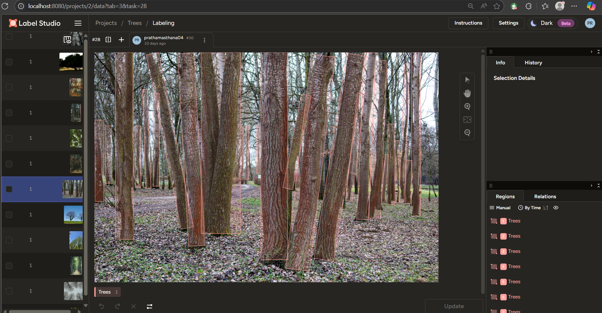

# Tree Detection and Counting using YOLOv8

This project presents a complete AI pipeline for detecting and counting **individual trees** in images using the custom trained **YOLOv8**  model. Given the unavailability of a suitable public dataset, all image data was **manually collected and annotated**, ensuring precision and relevance to the task.

---

## Project Structure

```bash
├── .git/                        
├── dataset/                    
│   ├── images/                 
│   └── labels/                 
├── documentation/             
│   └── Tree Detection and Counting.pptx
├── exported data/            
├── raw_data(images)/         
├── runs/                      
├── test images/               
├── .gitattributes             
├── data.yaml                  
├── data_splitter.py          
├── rename.py                 
├── model.ipynb               
├── sample6_annotated.jpg     
├── yolov8n.pt                
├── yolov8n-oiv7.pt          
├── yolov8m-oiv7.pt           
├── README.md                
```


---

## Objective

- Detect individual trees in group images from a front-facing view.
- Automatically count the number of trees using bounding box detection.
- Leverage a lightweight and real-time object detection model (YOLOv8).

---

## Data Collection & Annotation

- **Manual Collection**: All images were gathered manually from online sources. No public dataset exists for this specific tree detection and counting task.
- **Annotation**: Each image was labeled using bounding boxes to identify **every visible tree**.
- **Format**: Annotations were prepared in YOLO format (txt files with normalized coordinates).
- **Dataset Size**: 113 images divided into training and validation (80:20).


---

## Model Training (Approach 2 - Used in this Repository)

| Detail              | Description                                      |
|---------------------|--------------------------------------------------|
| Model Variant       | YOLOv8n and YOLOv8m (Ultralytics)                |
| Pretrained Weights  | Used for fine-tuning                             |
| Epochs              | 100                                              |
| Input Format        | YOLOv8 (images + label text files)              |
| Dataset Split       | 80% training, 20% validation                     |
| Augmentation        | Applied during training                          |
| Loss                | Minimized effectively even with limited data     |

### Output:
- Accurate detection and bounding boxes for **individual trees**.
- Correct **counting of trees** in images.
- Output images and results saved in the `runs/` directory.
- Sample output: `sample6_annotated.jpg`

---

## Limitations

- **Data Availability**: No publicly available dataset with tree group images.
- **Manual Annotation**: Labeling each image is time-consuming.
- **Evaluation Challenge**: If even one tree is missed, standard metrics may not reflect performance fairly.
- **Accuracy**: Can improve with more data and hyperparameter tuning.

---

## Improvements Planned

- Expand the dataset with more varied group-tree images.
- Train on **YOLOv8m** with a higher VRAM GPU for better results.
- Optimize **hyperparameters** for further improvements in precision and recall.
- Explore methods to handle overlapping or obscured trees better.

---

## Documentation

Project explanation and comparison of different approaches is available in the PowerPoint inside the [`documentation/`](documentation/) folder.

---

## Scripts and Tools

- `data_splitter.py` – Randomly splits the dataset into train/val sets.
- `rename.py` – Utility for renaming files consistently.
- `model.ipynb` – YOLOv8 training and inference notebook using Ultralytics.

---

## Model Weights

- `yolov8n-oiv7.pt` – Trained YOLOv8n model on custom data.
- `yolov8m-oiv7.pt` – Trained YOLOv8m model (better accuracy, higher resource requirement).
- `yolov8n.pt` – Base pre-trained weights for YOLOv8n.

---

## License & Credits

- All data collected and annotated manually by the project author.
- No proprietary or paid data has been used.

---

## Usage

Follow the steps below to train the model and run inference:

---

### Clone the Repository

```bash
git clone https://github.com/pratham-asthana/tree-detection-yolov8.git
cd tree-detection-yolov8
```


## Contact

For any questions, feel free to raise an issue or connect via [GitHub](https://github.com/pratham-asthana).
